  
  
  
  
  
  
  

<h2>
  <strong>Hi there, I am <a href="https://github.com/ArthurFiorette">Arthur Fiorette</a>! 👋</strong>
  
</h2><h6>
  Working on my
  <a href="https://github.com/ArthurFiorette?tab=repositories">
    Open Source</a> Projects.
   
  Learning <i>web development</i>.
</h6>

  <code>
    
   
    
  </code>

 

  <code>
    ▪▫▫ <a href="https://github.com/ArthurFiorette" target="_blank">»</a>
  </code>

